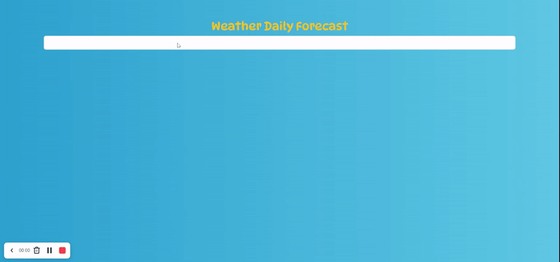

# weatherApp-React

## Description

Project aims to create a WeatherApp.

## Project
https://weather-app-react-omer-yagci.vercel.app/

## Objective
Build a WeatherApp using ReactJS.

## What I used;

Bootstrap 5

Components

useState

useEffect

array map method

Toastify library

Props

API

Destructuring props

useContext

Custom Hooks

SCSS

